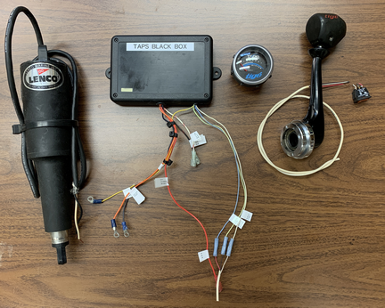
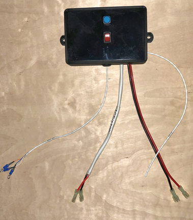
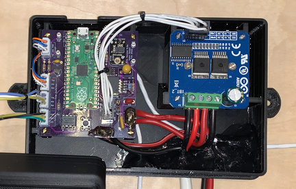
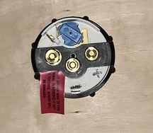

# Replacement Tige TAPS Trim Controller

This is a replacement for the original trim controller for an early 2000's [Tige](https://www.tige.com/) 22v wakeboard boat.
The *electric actuator* is made by [Lenco](https://www.lencomarine.com), the Tige logo'd
trim indicator gauge is probably made by [Faria](https://fariabeede.com), and the
"black box" controller is under the dashboard.  The "black box" takes the trim switch input and drives the actuator
and gauge.  Coupled with a plate on the transom, Tige called the entire system **TAPS2**.

The original controller is prone to failure, and is no longer available from Lenco or Tige.  There are
other solutions from Lenco but there are none which retain the use of the original trim switch and Tige
gauge.

Tige's TAPS controller fully retracts the actuator at each start so one must
reposition the trim at every restart.
This project improves on the original implementation by saving the final actuator position for the next
restart.
If everything works right, the trim will not move and the gauge will be correctly positioned when the
boat is restarted.

The controller's external connections are power and ground, trim switch top/middle/bottom,
gauge power/ground/signal, and two actuator motor power leads.  The controller box has a lighted
setup pushbutton and redundant trim switch.
The box, while deeper than the original controller, has the same footprint.

This project includes the controller's schematic diagram and PCB layout, a 3D printable enclosure, and the C++
controller software.  With access to a 3D printer, the cost of the controller should be approximately $50.

# Making the Controller

The replacement controller is a custom processor board connected to a commercial
[H-Bridge](https://en.wikipedia.org/wiki/H-bridge)
to switch the relatively high current actuator connections.
The processor board holds a [Raspberry Pi Pico](https://www.google.com/search?q=raspberry+pico) and surrounding
glue circuitry.

## Processor Board

The [pcb](pcb) directory holds the [KiCad 6](https://www.kicad.org/) files detailing the schematic and
printed circuit layout, and
[bin/TAPS.zip](bin)
is a
[Gerber](https://en.wikipedia.org/wiki/Gerber_format)
file to send to a printed circuit board
fabricator such as [OSHPARK](https://oshpark.com/).

Almost all components are available at [Digi-Key](https://www.digikey.com/) and the schematic is annotated with
manufacturer and product numbers for each component.
The Pico power supply is from [adafruit](https://www.adafruit.com/product/4683).
In addition to the usual soldering supplies, a special crimper
( [Amazon](https://www.amazon.com/dp/B088NQV8Z3) )
is needed for the board's connectors though
one could skip the connectors and solder the wires to the boards.

## H-Bridge

The commercial H-Bridge is a BTS7960 43A High Power Motor Driver Module and can be purchased on Amazon for less than $10 from
[several souces](https://www.amazon.com/s/?url=search-alias%3Daps&field-keywords=BTS7960+43A+Motor+Driver+Module).
The H-Bridge board has an 8 pin header for its logic connections to the processor board; replace this header with the same locking connector
as the processor board to improve robustness.

## Code

The C++ code is compiled on Linux with the [Raspberry Pi Pico C/C++ SDK](https://datasheets.raspberrypi.com/pico/raspberry-pi-pico-c-sdk.pdf).
Go to the [src](src) directory, type `cmake -B build` followed by `cd build && make` to generate the executable to
copy to the Pico processor as described in the SDK. The most recent executable is [bin/taps.elf](bin).

## Enclosure and Switches

The [box](box) directory holds the [SketchUp](https://www.sketchup.com/) enclosure design files.
[Cura](https://ultimaker.com/software/ultimaker-cura) successfully slices
[bin/boxBottom.stl](bin) and [bin/boxTop.stl](bin)
for an [Ultimaker 3D printer](https://ultimaker.com/) though other slicers and printers should work.
The ABS enclosure's bottom secures the boards and external wires with 2-56 screws, while the top holds the setup button and
auxiliary trim switch.
The auxiliary trim switch is a duplicate of the button used on the throttle of the Tige boat.
It is manufactured by
[E-Switch](https://www.e-switch.com/),
part number
R1966IBLKREDEF,
and available on
[Digi-Key](https://www.digikey.com/short/t0br9zjr)
as part number [EG5445-ND](https://www.digikey.com/short/t0br9zjr).
The 16mm illumated setup pushbutton is available from [adafruit](https://www.adafruit.com/product/1477)
and [amazon](https://www.amazon.com/dp/B0148183D2).

The box top and bottom are held together with two 6.3mm automotive plastic trim fasteners.

## Connections

Connect the three *gauge* wires to the existing Tige TAPS gauge -- these should be the only wires connected to
the gauge terminal posts.  This new black box supplies power to the gauge; **do not** also connect the gauge's power terminal to
the boat's electrical system.  Looking from the rear, the black box gauge *PWR* leads goes on the right, *GND* goes in the middle,
and *SIG* goes on the left.  **Connecting any power lead to the gauge's *SIG* terminal will damage the gauge.**
The spade terminal near the blue cap is for gauge illumination and this connection should go to the lighting circuit
shared with the other instruments.

Connect the black box's two actuator leads to the two leads coming from the Lenco electric actuator.  Polarity
is only important when it comes time to ensure the actuator retracts when the black box thinks it should be
retracting, and extends when the black box thinks it is extending the actuator.  If you get the leads backwards,
they can simply be plugged in the other way.

Connect the three trim switch wires to the boat's trim switch ... on my boat this switch is on the throttle handle.
There is no appreciable current flowing through the trim switch so any secure means of connection (any kind of connector)
should be fine.  Do not otherwise connect the boat's power or ground to these connections.

Finally, connect the black box's power and ground to the electrical system.  The power lead should be connected, most likely,
to the same 15A breaker that was powering the original black box (actually, a 10A breaker is probably adequate).

# Setup

The black box has a *setup mode* entered by pressing its pushbutton.  The button's LED pulses
when the box is in *setup mode* and goes dark when *setup mode* is exited.  *Setup mode* is automatically exited after one
minute of inactivity, or if the pushbutton is pressed and held for at least two seconds.

As soon as *setup mode* is entered, the actuator should fully retract.
If the actuator extends instead of retracts, simply reverse the actuator leads and try again.
When not in
*setup mode*, pressing the side
of the rocker switch nearest the pushbutton should extend the actuator, the other side of
the rocker switch should retract it.
Similarly, pressing the top of the rocker switch on the throttle should extend the actuator and the bottom half of the
switch should retract it.  Something is wrong with the
throttle's switch or wiring if the box's rocker switch works but the throttle's does not.

The primary purpose of *setup mode* is to calibrate the TAPS gauge.  This is done by manually setting the gauge's fully retracted (wakeboard) and 25% - 50% - 75% - 100% extended (slalom) gauge needle positions.  More specifically, the gauge's 8, 6, 4, 2, and 0 readings are adjusted.  Enter *setup mode* to adjust these positions and use the trim switch to set the needle's **8** position.  Press the
setup button and set the needle's **6** position.  Press the button and set the **4** position; continue for the **2** and **0** positions.
*Setup mode* automatically exits once the button is pressed after adjusting for the **0** position.

# Operation

The trim switch and TAPS system should operate exactly as the original system, except:
- The new black box remembers the actuator and gauge positions when the boat is shut down.
The original box retracts the actuator and resets the gauge at every boat restart.

- The original black box runs the actuator as long as the trim switch is pressed; this replacement box stops the actuator
once it is 50% beyond the retract or extend limits.
In any case, running the actuator beyond its limits causes no harm to the actuator.

